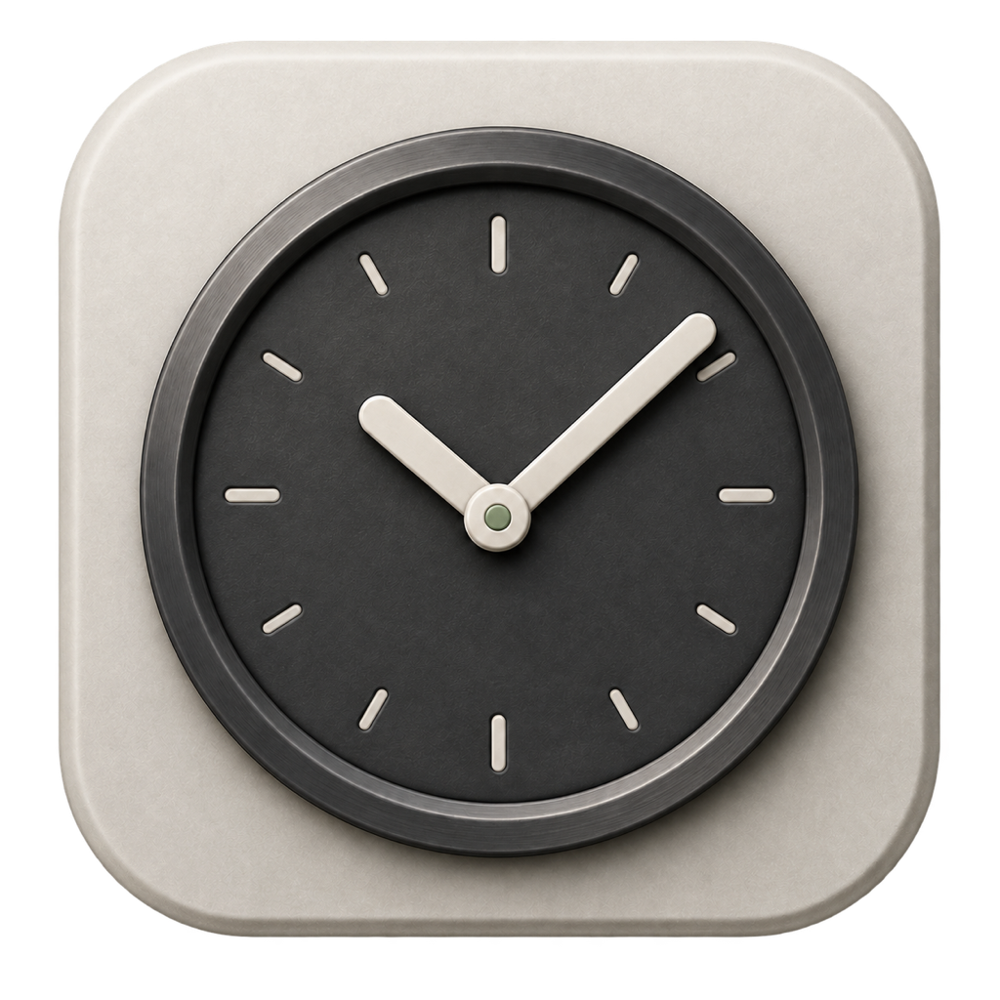

# TaskTick

<p align="center">
  
</p>

<h3 align="center">TaskTick</h3>

<p align="center">
  <strong>A native macOS app for managing scheduled tasks.</strong><br>
  No crontab, no launchd — just TaskTick.
</p>

<p align="center">
  <a href="https://github.com/lifedever/TaskTick/releases/latest"></a>
  <a href="https://github.com/lifedever/TaskTick/releases"></a>
  
  <a href="https://www.gnu.org/licenses/gpl-3.0.html"></a>
</p>

<p align="center">
  <a href="https://github.com/lifedever/TaskTick/releases/latest">⬇️ <strong>Download Latest</strong></a>
</p>

<p align="center">
  <a href="README_zh.md">中文文档</a>
</p>

---

<p align="center">
  
</p>

## Features

- **Menu Bar Resident** — runs in background, always accessible from menu bar
- **Flexible Scheduling** — date, time, repeat cycle with intuitive UI (like Reminders)
- **Script Execution** — inline scripts or local files (.sh, .py, .rb, .js)
- **Execution Logs** — stdout/stderr capture, exit codes, duration tracking
- **Background Programs** — start, stop, and supervise long-running commands with auto-start, restart policies, file output, and size-based log rotation
- **Notifications** — macOS system notifications on success/failure (per task)
- **Crontab Import** — import from system crontab with one click
- **i18n** — English & Simplified Chinese, switchable in-app
- **macOS 26 Ready** — liquid glass effects on supported systems

## Requirements

### Background programs

Choose **Background** on the editor's Schedule tab, then configure auto-start, restart policy, log path, maximum file size, and retained files under Settings.

- macOS 14 (Sonoma) or later
- Apple Silicon or Intel Mac

## Install

### Homebrew (Recommended)

```bash
brew tap lifedever/tap
brew install --cask task-tick
```

Update to the latest version:

```bash
brew upgrade --cask task-tick
```

### Download

Grab the latest `.dmg` from [Releases](https://github.com/lifedever/TaskTick/releases):

| File | Architecture |
|------|-------------|
| `TaskTick-x.x.x-arm64.dmg` | Apple Silicon (M1/M2/M3/M4) |
| `TaskTick-x.x.x-x86_64.dmg` | Intel Mac |

> On first launch: **Right-click TaskTick.app → Open → Open**
>
> Or run: `xattr -cr /Applications/TaskTick.app`

### Build from Source

```bash
git clone https://github.com/lifedever/TaskTick.git
cd TaskTick
swift build -c release
swift run
```

## License

GPL-3.0 © [lifedever](https://github.com/lifedever)
